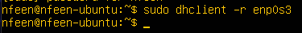
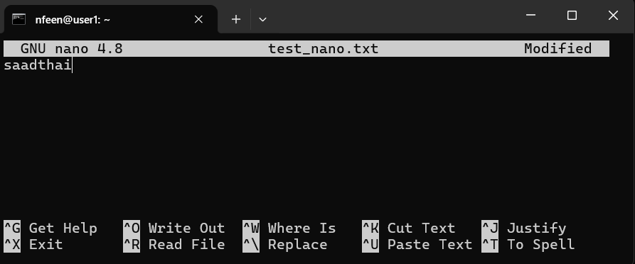
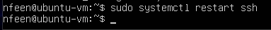

## Part 1. Установка ОС
- Версия Ubuntu\
  
## Part 2. Создание пользователя
- Вызов команды по созданию пользователя test_user с группой adm\
  
- Вывод команды cat /etc/passwd с информацией о пользователе test_user на последней строке\
  
## Part 3. Настройка сети ОС
- Команда для изменения hostname\
  \
  Также необходимо поменять старый hostname на user1 в /etc/hosts\
  
- Устанавливаем временную зону\
  
- Отображение сетевых интерфейсов\
  \
  **lo** – это loopback-интерфейс, который используется для обмена данными внутри самой машины (локально). Он всегда имеет IP-адрес 127.0.0.1
- Обнуляем уже имеющиеся данные на интерфейсе от dhcp\
  \
  И выдаем новый IP адрес\
  \
  Получаем адрес 192.168.43.134
  DHCP (Dynamic Host Configuration Protocol) – это протокол динамического назначения сетевых параметров, таких как IP-адрес, шлюз по умолчанию и DNS-сервер
- Публичный IP\
  \
  IP-адрес шлюза по умолчанию\
  
- Чтобы поставить статический адрес заходим в конфигурационный файл\
  \
  Изменяем конфигурацию следующим образом\
  \
  Подтверждаем данную конфигурацию\
  \
  Перезагружаем ВМ с помощью sudo reboot
  Теперь адрес изменился с 192.168.43.134 на 192.168.43.200\
  \
  Шлюз по умолчанию стал статическим\
  
- Пингуем 1.1.1.1 и ya.ru\
  
## Part 4. Обновление ОС
- Вводим следующие команды:
  sudo apt update - обновление информации о репозиториях
  sudo apt upgrade - скачивание обновлений
  sudo apt autoremove - удаление ненужных пакетов
  sudo apt clean - очистка кэша пакетов
  Затем можем увидеть, что все пакеты обновлены:\
  
## Part 5. Использование команды **sudo**
- Добавляем право на sudo для test_user\
  \
  sudo дает возможность выполнять операции от пользователя root, что дает безграничные права
- От нового пользователя меняем hostname\
  \
  Также изменяем hostname в /etc/hosts\
  
## Part 6. Установка и настройка службы времени
- Текущее время\
  
- Включение синхронизации происходит следующим образом\
  
- Проверяем, включен ли NTPSynchronized\
  
## Part 7. Установка и использование текстовых редакторов
- Создаем файл и добавляем свой ник
  VIM:
  Для выхода из файла и сохранения его нажимаем esc -> :wq\
  \
  NANO:
  Для выхода из файла и сохранения его нажимаем CTRL+O и CTRL+X\
  \
  MCEDIT:
  Для выхода из файла и сохранения его нажимаем F2 и F10\
  
- Редактирование файла
  VIM: 
  Чтобы выйти без сохранения изменений нажимаем esc -> :q!\
  \
  NANO:
  Чтобы выйти без сохранения нажимаем CTRL+X\
  \
  MCEDIT:
  Чтобы выйти без сохранения нажимаем F10\
  
- С помощью vim ищем слово School. Используем /School\
  \
  Чтобы заменить первое вхождение слова используем :s/School/Sber\
  \
  С помощью NANO ищем слово School. Нажимаем CTRL+W и вводим слово\
  \
  Для замены используем CTRL+\ \
  \
  С помощью MCEDIT ищем слово School. Для этого нажимаем F7\
  \
  Для замены нажимаем F4\
  
## Part 8. Установка и базовая настройка сервиса **SSHD**
- Установка службы SSHd (у меня уже есть)\
  
- Добавление автостарта службы при загрузке системы\
  
- Перенастройка службы SSHd на порт 2022
  Открываем конфигурационный файл в текстовом редакторе\
  \
  Изменяем строчку с портом на 2022\
  \
  Перезапускаем сервис\
  
- Проверка наличия процесса sshd с помощью команды ps\
  \
  -e - выводит все процессы
  grep - фильтрует вывод
- Вывод команды netstat -tan\
  \
  Наш хост слушает порт 2022, значит все работает
  -t (или --tcp) - показывает только TCP соединения
  -a (или --all) - показывает все активные соединения и порты, которые находятся в состоянии Listen
  -n (или --numeric) - отображает ip адреса и номера портов в числовом формате, без имен хостов или служб
  0.0.0.0 - обозначает все адреса
  Proto - показывает используемый протокол
  Recv-Q - Количество данных, которые находятся в очереди на получение (в байтах)
  Send-Q - Количество данных, которые находятся в очереди на отправку (в байтах)
  Local Address - локальный адрес, который ждет соединения
  Foreign Address - удаленный адрес устройства, с которым будет установлено соединение (в нашем случае это любое устройство)
  State - текущее состояние соединения (в нашем случае Listen, что означает, что мы ожидаем входящего подключения)
## Part 9. Установка и использование утилит **top**, **htop**
- Вывод команды top\
  \
  __uptime__ - 41 min
  __Количество авторизованных пользователей__ - 2 users
  __Средняя загрузка системы__ - 0.00 (количество задач, ожидающих выполнения)
  __Общее количество процессов__ - 122
  __Загрузка CPU__ - **us**: Пользовательские процессы (0.1%), **sy**: Системные процессы (0.0%), **ni**: Процессы с изменённым приоритетом (0.0%), **id**: Время простоя CPU (99.8%), **wa**: Ожидание ввода/вывода (0.0%), **hi**: Аппаратные прерывания (0.0%), **si**: Программные прерывания (0.1%), **st**: Время, "украденное" гипервизором (0.0%)
  __Загрузка памяти__ - 185.7 used
  __PID процесса занимающего больше всего памяти__ - 1 (systemd 0.3%)
  __PID процесса занимающего больше всего процессорного времени__ - 1625 (kworker/2:0-events 0.7%)
- Вывод команды htop
  Отсортированный по PID\
  \
  Отсортированный по PERCENT_CPU\
  \
  Отсортированный по PERCENT_MEM\
  \
  Отсортированный по TIME\
  \
  Отфильтрованный для процесса sshd\
  \
  С процессом syslog, найденный через поиск\
  \
  Добавляем вывод hostname, clock и uptime\
  
## Part 10. Использование утилиты **fdisk**
- Жесткий диск из команды fdisk -l\
  \
  Название - /dev/sda
  Размер - 25GiB
  Количество секторов - 52428800 (размером по 512 байт)
## Part 11. Использование утилиты **df**
- Вывод команды df\
  \
  Размер раздела - 11758760 KiB
  Размер занятого пространства - 5326836 KiB
  Размер свободного пространства - 5812816 KiB
  Процент использования - 48
- Вывод команды df показывает использование памяти в килобайтах
- Вывод команды df -Th\
  \
  Размер раздела - 12 GiB
  Размер занятого пространства - 5.1 GiB
  Размер свободного пространства - 5.6 GiB
  Процент использования - 48
- Тип файловой системы корневого раздела - ext4
## Part 12. Использование утилиты **du**
- Вывод команды du\
  
- Вывод размера папок /home, /var, /var/log (в байтах, в человекочитаемом виде)\
  
- Вывод размера всего содержимого в /var/log (не общее, а каждого вложенного элемента, используя \*)\
  
## Part 13. Установка и использование утилиты **ncdu**
- Вводим команду ncdu /home\
  \
  Размер 96.5 Килобайт
- Вводим команду ncdu /var\
  \
  Размер 899.5 Мегабайт
- Вводим ncdu /var/log\
  \
  Размер 60.1 Мегабайт
## Part 14. Работа с системными журналами
/var/log/dmesg - логи запуска ядра
/var/log/syslog - системные логи
/var/log/auth.log - логи авторизации
- Находим последнюю авторизацию в /var/log/auth.log\
  \
  Время - Mar 23 20:46:41
  Имя пользователя - nfeen
  Метод входа - LOGIN
- Находим сообщение о рестарте sshd в /var/log/syslog\
  
## Part 15. Использование планировщика заданий **CRON**
- Строчки в системном журнале о выполнении (чтобы добавить задачу открываем crontab -e и пишем в нем \*/2\* \* \* \* uptime)\
  
- Список текущих задач для CRON\
  
- Список задач после удаления (пустой)\
  